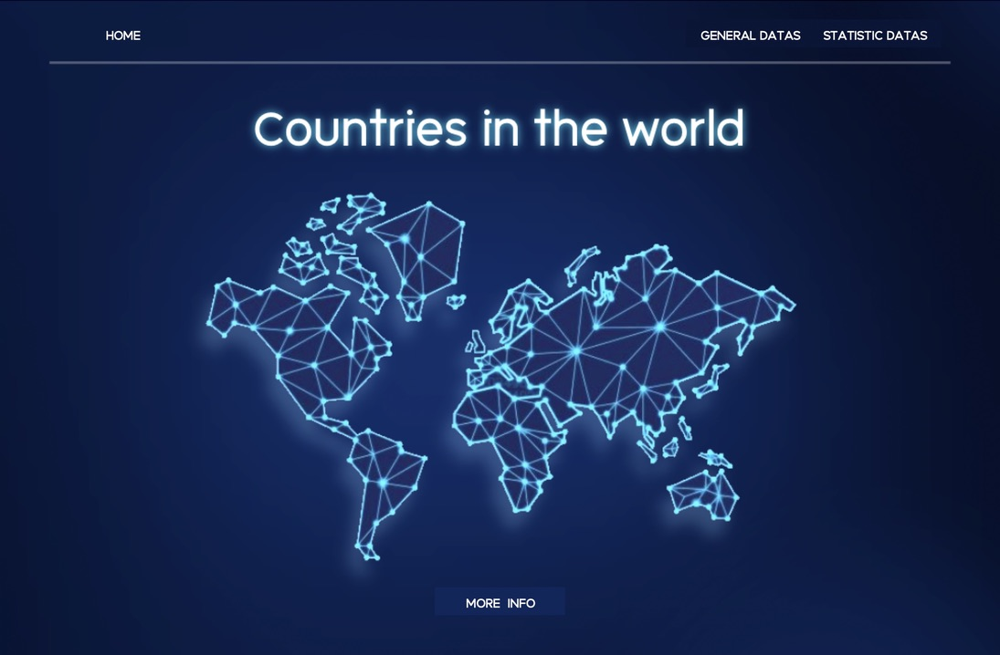
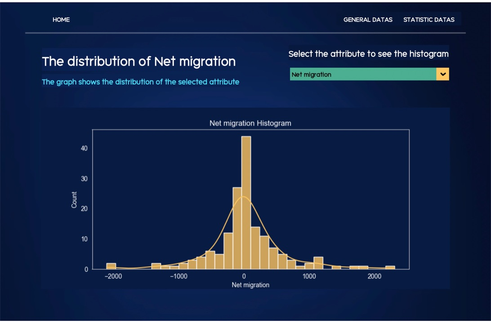
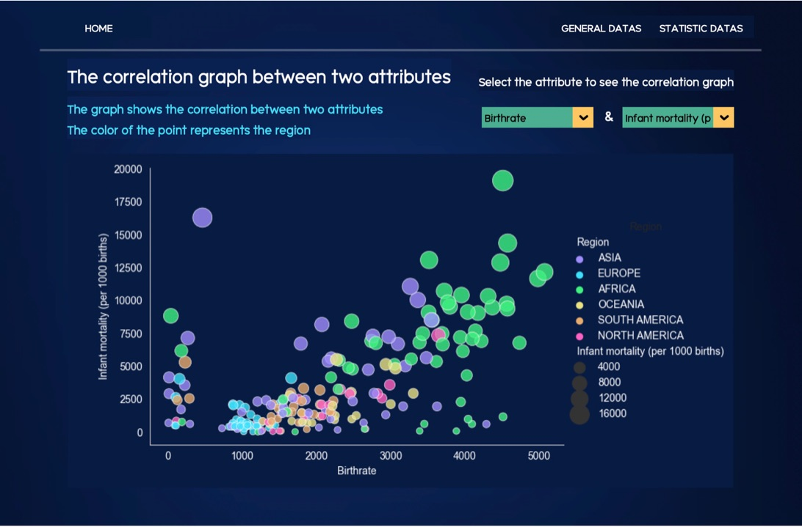
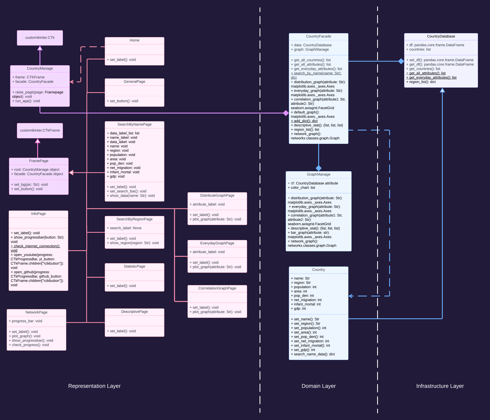
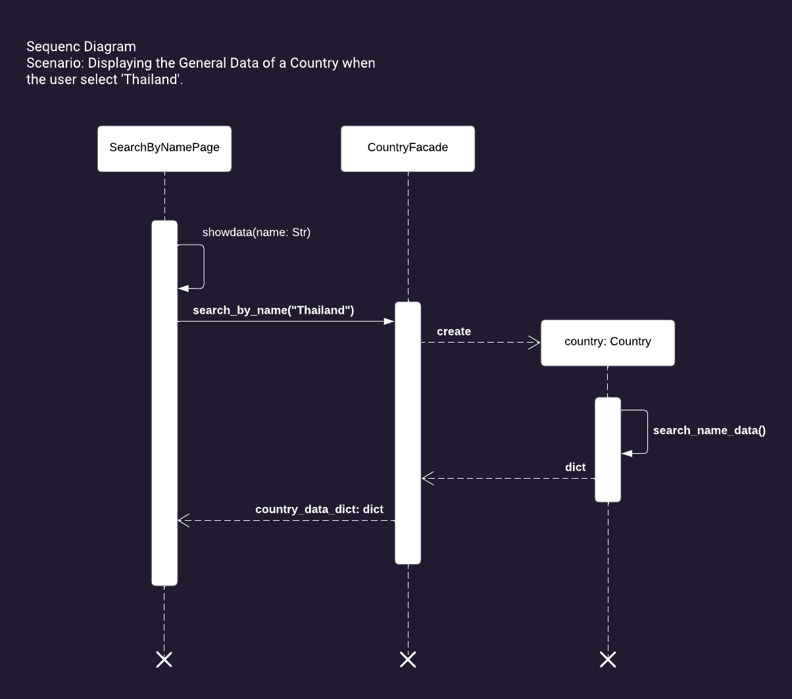

# COUNTRIES IN THE WORLD




## Description
  
Countries in the world is the year project about the visualization of data processing. 
The user can see the various visualizations with more than 200 countries in the world.
These are our features in the application.
* User can see the general information of each country.
* User can see all the countries in each continent.
* User can see the statistic of various attributes through the visualization including various types of graph.<br />

see the demonstration video [here](https://youtu.be/qPPtqwabqyU)

## Data Sources

This is the initial data source that we use in our application. I modified the data to be more suitable for our application.
[Countries in the world](https://www.kaggle.com/fernandol/countries-of-the-world) by Fernando Lasso <br />
About Dataset: Information on population, region, area size, infant mortality and more.

 
## Running the Application

The program needs to be run with the following packages installed (that are in requirements.txt):
* `customtkinter` : used for the custom theme of the application.
* `matplotlib` : used for the visualization.
* `networkx` : used for the graph processing.
* `pandas` : used for the data processing.
* `Pillow` : used for the image processing.
* `seaborn` : used for the visualization.<br />

For better experience, I recommend you to download font `PK MEAHONGSON` [here](https://www.f0nt.com/release/pk-maehongson/#google_vignette) is the font source I downloaded.

Install the packages required with the following command:
```bash
pip install -r requirements.txt
```

## Design



The program composes of 3 main layers:
### representation layer
This layer is responsible for the user interface. The user can interact with the program through this layer.<br />
consists of 13 classes:
* `CountryManage` : is the main window of the program. Inherit from customtkinter.CTk module. Has the method to manage the page of the program.
* `FramePage` : is the parent class of all the page in the program. Inherit from customtkinter.CTkFrame module. Has the method to set background and set the menu bar of the page.<br />
These following classes is the child class of FramePage, represent each page of the program:
`Home`,`GeneralPage`,`SearchByNamePage`,`SearchByRegionPage`,`StatisticPage`,`InfoPage`,`NetworkPage`,`DescriptivePage`,`DistributeGraphPage`,`EverydayGraphPage`,`CorrrelationGraphPage`
all the page has the method to set the labels of the page and may have some method relate with graph visualization.
### Domain layer
This layer is responsible for the data processing. It is implemented using pandas. The data is processed and stored in the form of a graph.<br />
consists of 3 classes:
* `Country` : is the class that represent each country. Has the method to get the information of each country.
* `CountryFacade` : is the facade of the program.
* `GraphManage` : is the class that create the graph.
### Infrastructure layer
This layer is relate with the database.
consists of 1 class that is `CountryDatabase` : is the class that manage the database. Has the method to get the data from the database.

### sequence diagram


The sequence diagram of the program is shown above. The scenario is to display the General Data of a Country when the user select 'Thailand'.<br />
In the search by name page when the user select 'Thailand' and click the button 'Search', the program will call self method `show_data` with param is the country's nanme. 
Then call the method `search_by_name` from the class `CountryFacade`. The facade will create the object of the class `Country` and call self method `search_name_data`. Then return the country's data dict to the page.


## Design Patterns Used
The design patterns used in the application is the facade. The program has the class name `CountryFacade` on the domain layer. 
This class is the facade of the program. It is the class that the representation layer can interact with. 
The representation layer can only interact with this class. This class will interact with the other classes in the domain layer and the infrastructure layer. 
This class will get the data from the database and process the data. Then, it will return the data to the representation layer. The representation layer will use the data to display to the user.
 
## Graph Algorithm Used
In the graph modeling part, I want users to be able to view population data comparisons between the countries they selected and other countries. Users will be able to see that Are there any countries that have a population similar to that of the chosen country? and are in the same continent?. And can also see if these two countries are on the same continent or not.<br />
The algorithm use is `Dijkstra algorithm` to find the shortest path between country S to every other country in the graph.
[here](https://docs.google.com/document/d/16ay6o_ryS9vPkxoauK2ojMzwe-nVgzSBEJGt0ggNelc/edit?usp=sharing) is the document that explain the algorithm in detail.

## Additional sources
Thanks for the sources that I use to create the program.
* for create multiple page
    * [stack overflow](https://rihttps://stackoverflow.com/questions/11855906/tkinter-lift-and-lower-methods-with-grid-layoutptutorial.com/tkinter/example/22131/arranging-the-window-stack--the--lift-method-)
    * [geeksforgeeks](https://www.geeksforgeeks.org/tkinter-application-to-switch-between-different-page-frames/)
    * [javapoint](https://www.javatpoint.com/tkinter-application-to-switch-between-different-page-frames-in-python)
* for plotting graph
    * [python-chart](https://python-charts.com/seaborn/background-color/#:~:text=By%20default%2C%20plots%20made%20with%20seaborn%20have%20a%20white%20background.)
    * [statology](https://www.statology.org/seaborn-background-color/)
* customtkinter
    * [github](https://github.com/TomSchimansky/CustomTkinter)
 
## Other Information
I have learned new thing and use new various libraries or packages or modules in the program. The important thing is I have tried to pay attention to what the user will see and what the user will interact with.
Are the visualization is clear to the user? what the objective to create these graphs? what the user will get from these graphs? and so on.

_I hope you enjoy the program. Thank you for your attention._
